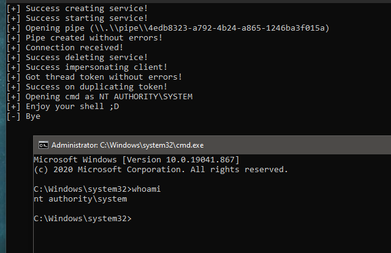

# SharpGetSystem

### Description

C# implementation of the classic "GetSystem" using WIN32 function [ImpersonateNamedPipeClient](https://docs.microsoft.com/en-us/windows/win32/api/namedpipeapi/nf-namedpipeapi-impersonatenamedpipeclient).

