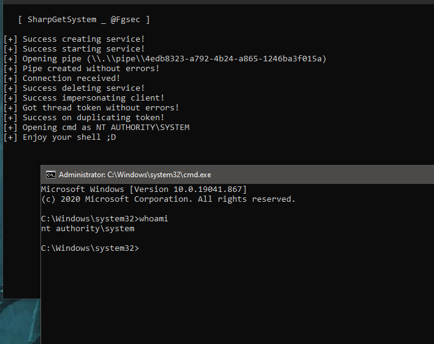

# SharpGetSystem

C# implementation of the [classic](https://www.offensive-security.com/metasploit-unleashed/privilege-escalation/) "GetSystem" using WIN32 function [ImpersonateNamedPipeClient](https://docs.microsoft.com/en-us/windows/win32/api/namedpipeapi/nf-namedpipeapi-impersonatenamedpipeclient).

